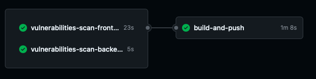

# Assignment Report and Documentation

## Frontend to Backend Connection

I fixed the issue with connecting the fronend to the backend  API by updating the fetch request URL:

```js
const response = await fetch(`${backendUrl}/items`);
```

I make sure that endpoints for operations like `fetchItems` and `createItems` are properly aligned with backend code.

## Setting Up CORS in the Backend

To allow cross-origin requests from my local development environment (localhost), I added the `cors` module to the backend Express.js application. This configuration enables the backend to accept requests from different origins, ensuring the frontend can communicate with the backend.

## Dockerization

I created the following files to facilitate Dockerizing both the frontend and backend applications:

- `Dockerfile`
- `.env.frontend`
- `.env.backend`
- `docker-compose.yaml`

Dockerfiles are designed in a way to have optimized docker images by using layers and images with necessary tools and not using a generic image for serving and also bring down the build time.

`docker-compose.yaml` is ready to be used by following command:

```bash
docker-compose up
```

## Portainer for Monitoring

I integrated **Portainer** to monitor container performance and provide an easy way to view logs.

## Vulnerability Checks in the CI/CD Pipeline

I added two steps in the CI/CD pipeline to scan for vulnerabilities in both the frontend and backend. If any critical vulnerabilities are detected, the pipeline halts to prevent deploying insecure code. Also all the packages is updated to address the vulnerabilities that was found during the developing this pipeline.

## CI/CD Pipeline and Image Tagging

In the CI/CD pipeline, after vulnerability checks, the following steps are executed:

1. Both the frontend and backend images are built.
2. The images are tagged with the first 6 characters of the `GITHUB_SHA` to ensure that each image is uniquely identifiable.
3. The images are also tagged with the `latest` tag for easier deployment with Docker Compose, ensuring the latest version is used.

### CICD Pipeline




Dockerhub URL: `https://hub.docker.com/u/alirezaeeali`